# Ranielli Montagna

## Full Stack Software Engineer

I build web and mobile products, REST APIs, micro frontends and product interfaces where architecture, performance, accessibility and user experience need to work together. Today, I work at Lemon Energia, connecting software engineering with business problems, automation and practical AI.

---

## About

I'm a full stack software engineer at Lemon Energia, with 5+ years of experience building scalable web and mobile applications with React, React Native, TypeScript, Node.js and Next.js.

At Lemon Energia, I work at the bridge between the Center of Excellence and business areas, helping turn operational needs into clearer processes, digital solutions and reliable automation. My focus is to understand the problem before proposing the technology, using AI pragmatically when it can reduce repetitive work, organize context or support better decisions.

At Luizalabs, I worked on solutions for Magalu physical store operations, contributing to inventory and logistics workflows across 1,000+ stores and the daily routine of 1,000+ stock clerks. I also led frontend initiatives in SaaS products, created a Design System adopted across multiple products, implemented quality standards and mentored developers.

Lately, my focus has expanded into AI applied to software development: LLM integrations, automation, agents and Model Context Protocol workflows that improve product delivery and developer productivity.

## What I Build

| Area | Focus |
| --- | --- |
| Web applications | Product interfaces, dashboards, landing pages, e-commerce and SaaS platforms |
| Backend and APIs | REST APIs, integrations, authentication, data modeling and scalable services |
| AI integration | LLM features, chat assistants, workflow automation and custom agents |
| Mobile products | React Native apps, API integrations, offline flows and operational tooling |

## Stack

## Experience

| Company | Role | Scope |
| --- | --- | --- |
| Lemon Energia | Software Engineer | Engineering at the bridge between the Center of Excellence and business areas, digital solutions, automation and applied AI |
| Luizalabs | Software Engineer | Web and mobile products, REST APIs, integrations and micro frontends for national retail operations |
| Smarten | Front-end Tech Lead | Frontend architecture, Design System, CI/CD, monitoring, mentoring and product delivery |
| SBSistemas | Front-end Developer | React, Electron, TypeScript, reusable components and interface engineering practices |

## GitHub Activity

> Public GitHub metrics are useful context, but they do not represent the full scope of production work, private repositories or business impact.

## Contact

I'm available for freelance projects, product engineering work and technical conversations around web, mobile, APIs and AI-assisted development.

- Website: [ranimontagna.com](https://ranimontagna.com)
- LinkedIn: [linkedin.com/in/rannimontagna](https://linkedin.com/in/rannimontagna)
- Email: [contato@ranimontagna.com](mailto:contato@ranimontagna.com)
- GitHub: [github.com/RanielliMontagna](https://github.com/RanielliMontagna)

Built with the same care I try to bring to product interfaces: clear structure, useful details and no broken noise.
